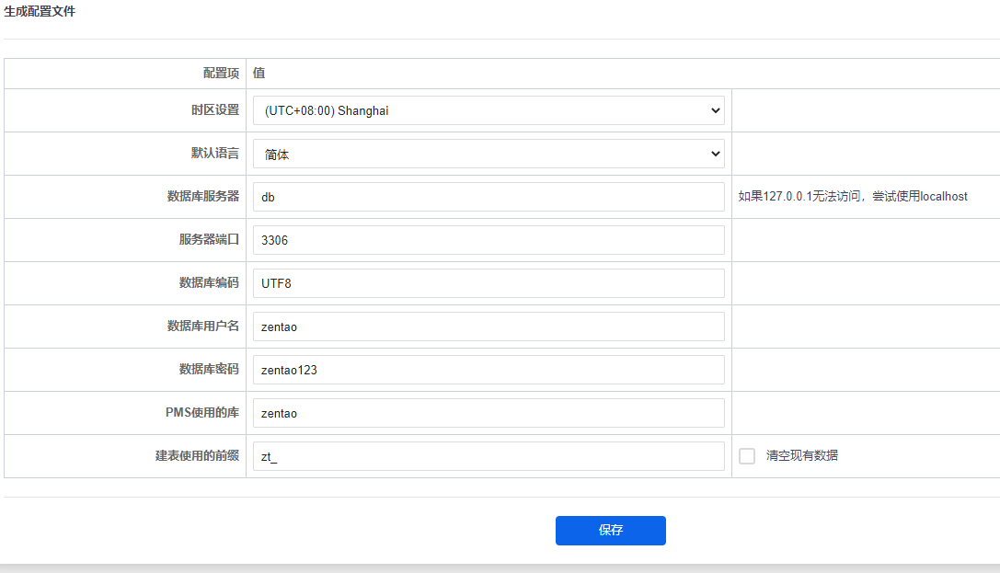

[English](#Docker-compose_zentao_Practice_deployment) | [中文](#禅道部署之Docker-compose)

# Docker-compose zentao Practice deployment
The zentao website provides a Docker deployment image, but the image is a package and the database is not deployed separately. The docker-compose method is provided here, which divides the database and PHP into two containers. The AdMiner container is also added to make it very easy to access and manage the database.
## Usage
1. Clone the project locally
2. Switch the directory to this project directory on the terminal
3. Run Docker-Compose Build
4. Run Docker-Compose up -d
5. Open 127.0.0.1:2048 in your browser and you will enter the Install page of Zentao.
6. Click next to enter the configuration file setting interface and enter the following figure

7. Click save and enter relevant information according to the page prompt for use
## ZenTao version updated
1. This Docker uses volume as data storage and can upgrade the version of Zen Buddhism through a simple Docker command, which is as follows:
```
docker-compose stop
docker-compose up -d
```
2. Open http://your host/upgrade.php and follow the prompts on the page.

> In the same version, if the container creation operation again may cause the open page prompt to delete the file, just follow the page prompt.

> Different versions of the page will prompt you to create a file in the directory. You can use the Docker exec directive to add it to the container and execute commands, such as:
```
docker exec -it zentao_docker-compose_web_1 bash
root@bdca:/var/www/html# touch /var/www/zentaopms/www/ok.txt
root@bdca:/var/www/html# exit
```

## Zen Migration
1. Simply migrate the container and volume.
## other
- If you encounter any problems, please feel free to submit an issue to this project
- Database management can log in 127.0.0.1:8080 with the login interface as follows

- About data migration.You can import data from the original database on the AdMiner page.If you open the Zen Path home page and jump to the upgrade.php page, you need to upload the upgrade.php file to the WWW folder. After reloading the page, follow the prompts.
- If you do not have permission to upload to the page, you can execute instructions prompted by the page after entering Docker.
- in the backup data page prompt folder without permission, but after entering the Docker execution "chmod 777 / var/WWW/zentaopms/TMP/backup/" solution.
- can edit the/var/WWW/zentaopms/config/my PHP file, modify the configuration.

# 禅道部署之Docker-compose
禅道官网是有提供docker部署镜像的，但这个镜像是套包，没有将数据库分开部署，这里提供docker-compose方式部署，将数据库和php分成了两个容器，同时增加了adminer容器可以非常方便的访问和管理数据库。

## 使用方法
1. 克隆项目到本地
2. 在终端上切换目录到此项目目录中
3. 运行docker-compose build
4. 运行docker-compose up -d
5. 在浏览器中打开127.0.0.1:2048，会进入禅道的install页面。
6. 点击下一步进入配置文件设置界面，输入如下图

7. 点击保存之后根据页面提示输入相关信息即可使用

## 禅道版本更新
1. 本docker使用volume作为数据存储，可以通过简单的docker命令升级禅道版本，命令如下：
```
docker-compose stop
docker-compose up
```
2. 打开http://your host/upgrade.php，根据页面提示操作即可。
> 同版本如果再次执行容器创建操作可能会造成打开页面提示删除文件，按页面提示操作即可。

> 不同版本页面会提示在目录下创建文件，可以使用docker exec指令加入容器内部，执行命令，例如：
```
docker exec -it zentao_docker-compose_web_1 bash
root@bdca:/var/www/html# touch /var/www/zentaopms/www/ok.txt
root@bdca:/var/www/html# exit
```

## 禅道迁移
1. 直接迁移container和volume即可。

## 其他
- 如遇到问题，欢迎给本项目提交issue
- 数据库管理可登录127.0.0.1:8080, 登录界面如下

- 关于数据迁移。可以在adminer页面导入原来数据库的数据。如果打开禅道主页跳转到upgrade.php页面，需要上传upgrade.php文件到www文件夹下，重载页面后按照提示操作即可。
- 在页面上传如提示文件夹没有权限，可在进入Docker后执行页面提示的指令。
- 在备份数据页面如提示文件夹没有权限，可在进入Docker后执行“chmod 777 /var/www/zentaopms/tmp/backup/”解决。
- 可以通过编辑/var/www/zentaopms/config/my.php文件，修改配置。
